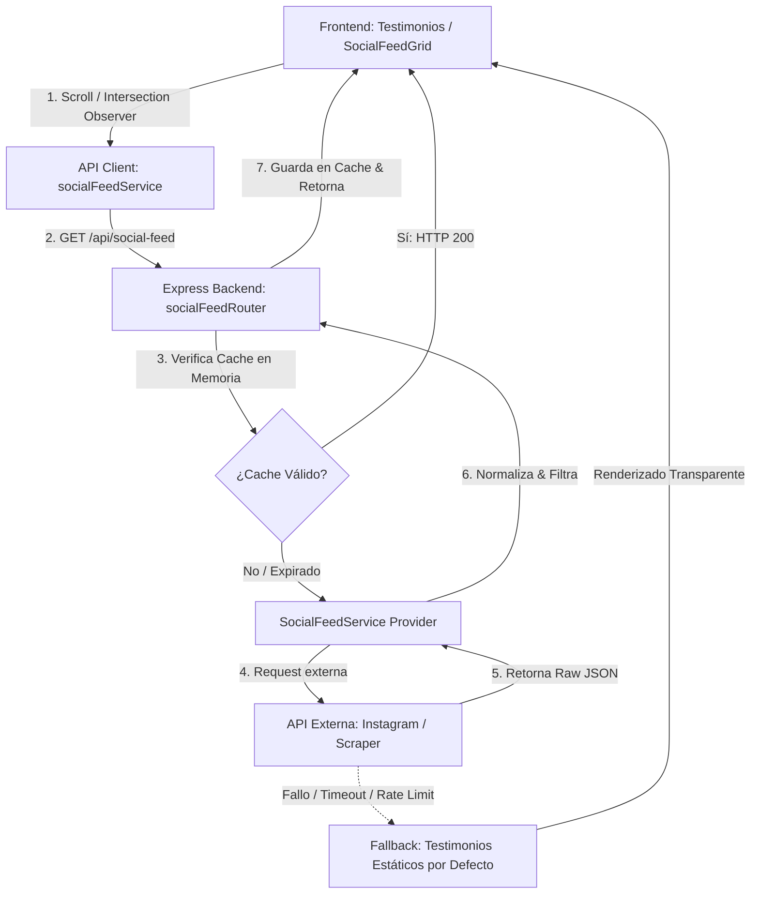

# Plan de Trabajo Unificado: Integración de Feeds de Redes Sociales (Instagram)

Este documento detalla la arquitectura, el diseño técnico y la hoja de ruta metodológica para integrar feeds de redes sociales (con foco inicial en Instagram) en el framework MERN. Dado que este repositorio actúa como un **boilerplate** del cual dependen otros proyectos, la solución está diseñada para ser modular, desacoplada, configurable mediante Feature Flags y resiliente ante fallos de APIs externas.

---

## 🏛️ Diseño de Arquitectura

Para garantizar que esta feature no afecte la estabilidad ni el rendimiento de los sitios que heredan del boilerplate, se propone una arquitectura basada en **Capa de Abstracción de Proveedores** (Backend) y **Carga Perezosa con Fallback Automático** (Frontend).



### 1. Variables de Configuración y Feature Flags (`packages/shared`)
El control de la feature se gestiona centralizadamente en `packages/shared/src/config/features.ts` mediante el flag `ENABLE_SOCIAL_FEEDS`.

* **`FEATURES.ENABLE_SOCIAL_FEEDS: boolean`**: Activa o desactiva por completo la lógica en el monorepo.
* **`socialFeeds` en el Perfil de Usuario (`packages/portal/backend/models/userModel.ts`)**:
  Permite configurar la integración a nivel de tenant/usuario (SaaS).
  ```typescript
  socialFeeds?: {
    instagram?: {
      enabled: boolean;
      username?: string;
      accessToken?: string;
      tokenExpiresAt?: Date;
      providerType: 'mock' | 'basic_display' | 'rapidapi_scraper';
    }
  }
  ```

### 2. Capa del Backend (`packages/portal/backend`)
El backend no se acopla a un único proveedor de red social. En su lugar, implementa un servicio basado en la interfaz `ISocialFeedProvider`.

```typescript
// packages/shared/src/types/socialFeed.ts
export interface SocialPost {
  id: string;
  mediaUrl: string;
  permalink: string;
  caption?: string;
  mediaType: 'IMAGE' | 'VIDEO' | 'CAROUSEL_ALBUM';
  thumbnailUrl?: string;
  timestamp: string;
  likesCount?: number;
  commentsCount?: number;
}

export interface ISocialFeedProvider {
  getRecentPosts(config: Record<string, any>, limit: number): Promise<SocialPost[]>;
}
```

#### Estrategia de Caché en Memoria (`In-Memory Cache`)
Para evitar sobrecargar las APIs de redes sociales, el consumo excesivo de créditos de scrapers y problemas de límite de solicitudes (Rate Limiting):
* Las peticiones exitosas se almacenan en un caché en memoria usando la infraestructura existente en `packages/portal/backend/utils/cache.ts`.
* **Tiempo de Expiración (TTL) configurable**: Por defecto **6 Horas** (4 peticiones diarias por perfil). Esto optimiza el consumo al máximo para encajar holgadamente dentro del plan gratuito de la API.
* **Flexibilidad de actualización**: Se introduce la variable de entorno `SOCIAL_FEED_CACHE_TTL` (en milisegundos). Si el cliente adquiere un plan de pago del scraper y requiere mayor frecuencia de actualización (ej. cada 30 minutos o 1 hora), puede reducir este TTL sin modificar el código.
* Si el servidor se reinicia, el caché se vacía y se vuelve a poblar de forma perezosa en la primera request de un cliente. Evitamos así escrituras innecesarias en MongoDB.

### 3. Estrategia del Frontend (`packages/portal/frontend`)
La interfaz del usuario prioriza el rendimiento y la estabilidad (Resiliencia UI):

* **Lazy Loading mediante Intersection Observer**: El frontend no realiza ninguna petición al endpoint de redes sociales hasta que el componente `SocialFeedGrid` entra en el viewport del usuario. Esto previene el uso de tokens y peticiones en páginas donde el usuario no hace scroll hacia abajo.
* **Skeletons de Carga Premium**: Mientras la API externa responde, se muestra una plantilla animada en CSS que simula la distribución de las tarjetas de Instagram para una experiencia de usuario fluida.
* **Mecanismo de Fallback a Testimonios por Defecto (Red de Seguridad)**:
  * Si la llamada al backend devuelve un error (ej. token expirado, API caída, límite de cuota superado) o la petición tarda más de 3 segundos (Timeout):
  * **Acción**: El componente de React intercepta el error de forma silenciosa (sin romper la UI) y renderiza automáticamente la sección clásica de **testimonios estáticos hardcodeados** (actuando como el valor "por defecto").
  * **Resultado**: El usuario final siempre ve contenido de calidad (ya sean las redes sociales reales en tiempo real o testimonios destacados preconfigurados).

---

## 🛠️ Alternativas Técnicas de Integración

Presentamos tres alternativas metodológicas con sus requerimientos de datos y flujos de usuario:

### Alternativa A: API Oficial (Instagram Basic Display API)
*Recomendada para que los usuarios conecten su propia cuenta de Instagram y traigan su feed real.*

* **Datos Requeridos (Credenciales a nivel App en Meta Developers)**:
  * `INSTAGRAM_CLIENT_ID`
  * `INSTAGRAM_CLIENT_SECRET`
  * `INSTAGRAM_REDIRECT_URI` (ej. `https://tuapp.com/api/social-feed/instagram/callback`)
* **Datos Requeridos (Usuario Final)**:
  * El usuario debe otorgar permisos mediante un flujo OAuth estándar de Facebook/Instagram.
  * Se almacena un **Long-Lived Access Token** (Token de Larga Duración - 60 días).
* **Flujo Técnico**:
  1. El usuario va al Dashboard de su cuenta -> "Conectar Instagram".
  2. Es redirigido al login de Instagram/Meta y aprueba los permisos `instagram_graph_user_profile` e `instagram_graph_user_media`.
  3. Meta redirige al backend con un código de autorización.
  4. El backend intercambia el código por un token de corta duración y luego por el de larga duración (60 días).
  5. Una tarea cron en el backend refresca este token automáticamente a los 30 días para evitar que caduque.
* **Ventajas**: Estable, oficial, permitido por las políticas de Meta, no sufre baneo de IPs.
* **Desventajas**: Requiere un proceso de revisión de la aplicación por parte de Meta para salir a producción.

### Alternativa B: API de Scraper No Oficial en RapidAPI (Opción Predeterminada en Producción)
*Recomendada para el boilerplate. Permite jalar publicaciones públicas ingresando solo el `@username`, sin requerir login OAuth de Facebook ni configuraciones complejas en Meta Developers.*

* **Datos Requeridos**:
  * API Key de RapidAPI (ej. `RAPIDAPI_KEY`).
  * Endpoint del Scraper (ej. `instagram-bulk-profile-scrappy` o similar).
  * Username público de la cuenta a consultar (ej. `@nike`).
* **Optimización de Costo Cero (Free Tier)**:
  * Al combinar esta alternativa con el caché en memoria del backend configurado a **6 horas por defecto**, solo se realizarán **4 llamadas al día** (aproximadamente 120 llamadas al mes) por perfil. Esto permite utilizar los planes gratuitos básicos de RapidAPI (que suelen ofrecer entre 100 y 500 llamadas gratuitas al mes) sin generar costos operativos para el cliente.
* **Flujo Técnico**:
  1. El administrador o usuario escribe el `@username` en la configuración de la web.
  2. El backend hace un fetch al proveedor de scraping enviando el username.
  3. El proveedor retorna el feed público formateado.
  4. El backend normaliza el JSON para cumplir con la interfaz `SocialPost`.
* **Ventajas**: Cero fricción para el usuario final (no requiere hacer login en Facebook), fácil y rápida de implementar en el boilerplate.
* **Desventajas**: Sujeto a cambios de diseño internos de Instagram que rompan el scraper, aunque el proveedor de RapidAPI suele encargarse de mantenerlo de forma transparente.

### Alternativa C: Mock Social Provider (Desarrollo local)
*Recomendada para desarrollo local rápido y pruebas estéticas sin configurar APIs.*

* **Datos Requeridos**: Ninguno.
* **Flujo Técnico**:
  1. El backend detecta que el proveedor está configurado como `mock`.
  2. Devuelve un conjunto de 6-8 publicaciones con imágenes placeholder estéticas y captions realistas.
* **Ventajas**: Permite probar toda la UI del portal instantáneamente al levantar el boilerplate.

---

## 📅 Plan de Implementación por Fases

### Fase 1: Configuración Global y Tipado
* **Objetivo**: Establecer los cimientos del código en el paquete compartido y backend.
* **Pasos**:
  1. Crear el archivo `packages/shared/src/types/socialFeed.ts` con las interfaces comunes `SocialPost` e `ISocialFeedProvider`.
  2. Agregar `ENABLE_SOCIAL_FEEDS: false` en `packages/shared/src/config/features.ts`.
  3. En `packages/portal/backend/models/userModel.ts`, añadir el campo `socialFeeds` dentro del schema del usuario para soportar la configuración de integración.

### Fase 2: Servicios de Backend y Proveedores
* **Objetivo**: Desarrollar la lógica del servidor para consultar y procesar los posts.
* **Pasos**:
  1. Crear la estructura de archivos en el backend:
     * `packages/portal/backend/services/socialFeed/ISocialFeedProvider.ts`
     * `packages/portal/backend/services/socialFeed/MockProvider.ts`
     * `packages/portal/backend/services/socialFeed/InstagramBasicDisplayProvider.ts`
     * `packages/portal/backend/services/socialFeed/ScraperProvider.ts`
  2. Crear el core orchestrator `SocialFeedService.ts` que determine qué proveedor usar basándose en la configuración activa y administre el caché en memoria.

### Fase 3: Endpoints de API y Middlewares
* **Objetivo**: Exponer las rutas del backend y protegerlas adecuadamente.
* **Pasos**:
  1. Crear `packages/portal/backend/routes/socialFeedRoutes.ts`:
     * `GET /api/social-feed/instagram/:username` -> Devuelve los posts normalizados con caché.
     * `POST /api/social-feed/instagram/config` -> Guarda la configuración de Instagram (requiere autenticación).
     * `GET /api/social-feed/instagram/auth-url` -> Retorna la URL de OAuth de Meta si se usa Basic Display.
     * `GET /api/social-feed/instagram/callback` -> Maneja el callback de redirección OAuth.
  2. Integrar las rutas en `packages/portal/backend/routes/index.ts` protegidas por el middleware `checkFeature("ENABLE_SOCIAL_FEEDS")`.

### Fase 4: Componentes Visuales en el Design System (`packages/shared/src/design-sys`)
* **Objetivo**: Crear componentes reutilizables y responsivos bajo la filosofía Mobile-First y las reglas de diseño del proyecto.
* **Pasos**:
  1. Crear el átomo `SocialPostCard` (`index.tsx`, `SocialPostCard.styles.ts`, `SocialPostCard.types.ts`):
     * Renderizado elegante de la imagen/video, caption truncado, link para abrir en Instagram, icono del tipo de media, y contador de likes/comentarios interactivo.
     * Efectos de hover sofisticados y soporte estricto para Temas Oscuro y Claro.
  2. Crear el componente `SocialFeedGrid` (`index.tsx`, `SocialFeedGrid.styles.ts`):
     * Layout fluido usando Flexbox / CSS Grid responsivo (sin anidamiento excesivo, utilizando la propiedad `gap`).
     * Integración de `Intersection Observer` para activar el fetch del feed solo cuando sea visible.
     * Integración de Skeletons y manejo de Fallback silencioso a testimonios estáticos en caso de error.

### Fase 5: Vista de Configuración en el Dashboard del Portal
* **Objetivo**: Permitir al usuario del SaaS gestionar la integración de sus redes sociales.
* **Pasos**:
  1. Crear una pestaña o sección en `packages/portal/frontend/src/pages/DashboardPage`:
     * Formulario para habilitar/deshabilitar la feature de feeds.
     * Campo para ingresar el `@username` de Instagram (para modo Scraper) o botón "Conectar con Instagram" (para modo OAuth).
     * Mensajes claros sobre el estado de la conexión (Conectado / Expirado / Desconectado).

---

## 🧪 Plan de Verificación y Control de Calidad

Para asegurar que los repositorios dependientes no sufran regresiones al integrar estos cambios:

1. **Pruebas de Desactivación Completa**:
   * Desactivar la feature (`ENABLE_SOCIAL_FEEDS: false`).
   * Validar que la aplicación web compile sin errores y las páginas con testimoniales muestren su contenido estático original de forma transparente, sin realizar llamadas HTTP al backend de social-feed.
2. **Pruebas de Simulación de Errores (Resiliencia)**:
   * Configurar un token inválido o apagar la conexión a internet en el backend.
   * Validar que el frontend capture el error de carga, oculte el skeleton e inmediatamente dibuje la lista de testimonios hardcodeados sin interrumpir la navegación del usuario.
3. **Validación del Caché en Memoria**:
   * Realizar múltiples peticiones seguidas al backend para un mismo usuario.
   * Verificar en los logs del servidor que solo la primera petición gatille la llamada al proveedor externo, y las siguientes consuman del caché en memoria instantáneamente.
4. **Verificación Mobile-First**:
   * Validar el diseño en breakpoints de 375px, 768px, 1024px y 1440px para garantizar la perfecta visualización y usabilidad del feed y la sección de testimonios.
